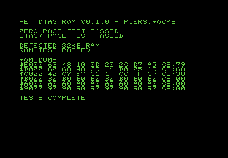

# 🖥️ pet-diag-rom

A simple diagnostics ROM for Commodore PET computers that provides comprehensive memory testing and ROM verification.

## 🔨 Building

```bash
sudo apt install cc65 vice
./build.sh
```

This will generate `f000-rom.bin` ready for burning to EPROM.

## 🚀 Running

1. Write `f000-rom.bin` to a 2764 or compatible EPROM
2. Insert the EPROM in the PET's top ROM socket (F000-FFFF)
3. Power on the PET - diagnostics run automatically



## 🧪 Tests Performed

- **Zero page RAM** ($0000-$00FF) - walking 1s, walking 0s, address-in-address
- **Stack page RAM** ($0100-$01FF) - same test pattern  
- **Main RAM** - comprehensive testing up to 32KB
- **ROM verification** - displays first 8 bytes and simple summation checksum for each ROM socket

## ❌ Interpreting Failures

### RAM Failures

**Expected failures:** Machines with less than 32KB RAM will show failures for unpopulated memory areas. The displayed page indicates the first missing RAM:

- `PAGE $20` = 8KB machine (normal)
- `PAGE $40` = 16KB machine (normal)

**Actual failures:** If populated RAM fails testing:
```RAM TEST FAILED - PAGE $xx```

**Critical failures:** These appear in the top-left corner:

- `ZP ERR` = Zero page RAM failure
- `SP ERR` = Stack page RAM failure

### 📦 ROM Verification

Since ROM sockets may be unpopulated or contain different versions, the diagnostic displays:

- **First 8 bytes** of each ROM location for visual verification
- **Simple summation checksum** (8-bit) for comparison against known values

Compare the displayed checksums against your ROM documentation or known-good dumps.

## 🎯 Compatibility

**Supported models:**

- PET 2001 (all variants)
- PET 3008, 3016, 3032
- PET 4016, 4032
- PET 8032

**Display compatibility:**

- Optimized for 40-column display
- Functional on 80-column models (not display-optimized)

**Memory support:**

- Tests up to 32KB of RAM
- Larger RAM configurations (8096, etc.) will have extra memory untested

## 💡 Technical Details

- Hijacks the reset vector at F000 for automatic execution
- Uses simple summation checksum algorithm for ROM verification
- Comprehensive RAM testing with multiple patterns
